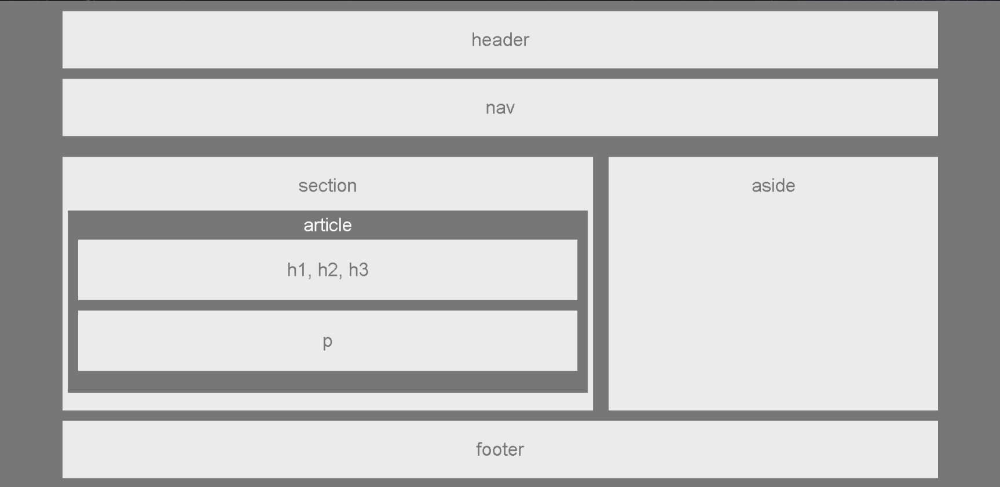

<h1> Wireframe </h1> 

## Instruduction 

This project was created to practice positioning with css. In particularly, we have practice floating.

## Tech used
* CSS

We utilize css positioning properties to make a static frame. 

## Challenges

Positioning element with css can be frustrating. In this static frame, we used obsolute and relative positing to achive the desired look.

<h2> Front End </h2>

